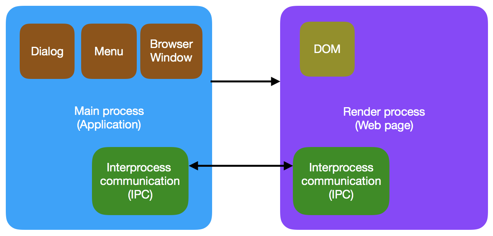

# Electron architecture

**Electron** builds cross-platform desktop applications with HTML, CSS, and JavaScript. Electron accomplishes this by combining Chromium(render library) and Node.js into a single runtime and apps can be packaged for Mac, Windows, and Linux.

**This figure shows how components of Electron are connected and their interactions**

There are two process types available in Electron **main process** and **render process**

**The main process** manages (e.g. creates) all web pages and their corresponding renderer processes. **Each renderer process** is isolated and only cares about the web page running in it.

If you want to perform GUI operations in a web page, the renderer process of the web page must communicate with the main process to request that the main process perform those operations.

**Electron** uses interprocess communication (IPC) to communicate between renderers and the main process in both directions. IPC is asynchronous by default but also has synchronous APIs.

### References

1. https://electronjs.org/docs/tutorial/application-architecture
